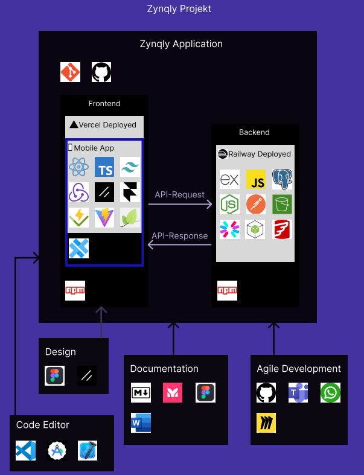

# Zynqly - smart-kassa

<p align=center>
 <a href="https://smart-kassa.vercel.app/"> </a>
</p>

## What is it about?

The goal of this project is to create a modern register system initially designed for taxi companies.
In the future, the system will be expanded and adapted for other business sectors.

### Key Features

- **Registering Rides**
- **Map with navigation to place of goal**
- **All rides documented and saved in a database**
  - **Sorting functionality**
  - **Beatiful Animation**
- **Dynamically generated invoice and saved it in a storage**
- **All invoices documented**
  - **PDF Viewer in App**
  - **QR Code to scan to access Invoice via a URL**
  - **Downloadable**
- **Dashboard with Analytics**
- **Safe Authentication System**
- **Mobile App for both iOS and Android**

### Availabe at

<p align=center>


<p>

## Tech Stack

### Application

- Git (Version Control System)
- GitHub (Cloud-Based Hosting Platform)

#### Overview

<p align="left">
  
  
</p>

### Frontend

#### Web App 

deployed on **Vercel**

- React (UI Libary)
- TypeScript (Programming Language)
- TailwindCSS (CSS Framework)
- Redux (State Managment)
- Shadcn/ui (Component Libary)
- Framer Motion (Animation Libary)
- Vitetest (Testing Framework)
- Vite (Build Tool)
- Leaflet (Map Libary)

#### Mobile App

- Capacitor (Cross-Platform-Framework)

#### Packet Manager

- npm (Node Packet Manager)

#### Overview

<p align=center>
  
  
  
  
  
  
  
  
  
  
  
  
  
  
</p>


---

### Backend

deployed on **Railway**

- Node.js (Runtime Environment)
- Express.js (Backend Framework)
- JavaScript (Programming Language)
- PostgreSQL (Database Management System)
- JWT (Authentication Method)
- Argon2 (Password Hashing)
- AWS SDK (Cloud Storage)
- Puppeteer (PDF Generation)
- Helmet (Security Middleware)
- Postman (API Testing)

#### Packet Manager

- npm (Node Packet Manager)

#### Overview

<p align="center">
  
  
  
  
  
  
  
  
  
  
</p>

---

### Design

- Figma (Design Tool)
- Shadcn/ui (Component Library)

#### Overview

<p align="left">
  
  
</p>

---

### Documentation

- Markdown (Markup Language)
- Mermaid Chart (Diagramming Tool)
- Figma (Design Platform)
- Microsoft Word (Word Processing Program)

#### Overview

<p align="center">
  
  
  
  
</p>

## Architecture

<p align="center">

</p>

[Live Project Architecture (in Figma)](https://www.figma.com/design/BPqmonzixS6mlzLSKTUJoK/Zynqly---Smart-Kassa-Project?node-id=0-1&t=Ozc1u6jbwHKQTLK8-1)

## Getting Started

### Requirements

#### General (Web & Mobile)

- **Node.js** (>= 18.18)
- **npm** (Node Package Manager)
- **Git** (Version Control)
- A code editor (e.g., Visual Studio Code)

#### Web Application

No additional requirements beyond the general setup.

#### Mobile - Android

- **Android Studio** (latest version)
- **JDK** (Java Development Kit 17 or higher)
- **Android SDK** (API Level 23 or higher)
- Android device or emulator

#### Mobile - iOS

- **macOS** (required for iOS development)
- **Xcode** (14.0 or higher)
- **CocoaPods** (iOS dependency manager)
- iOS device or simulator
- Apple Developer Account (for physical device deployment)

### Installation

#### 1. Clone the Repository

```bash
git clone https://github.com/zynqly-smartkassa/smart-kassa.git
cd smart-kassa
```

#### 2. Install Frontend Dependencies

```bash
cd frontend
npm install
```

#### 3. Install Backend Dependencies

```bash
cd ../backend
npm install
```

#### 4. Environment Configuration

**Frontend** - Create a `.env.local` file in the `frontend` directory:

```env
VITE_API_URL="http://localhost:3000"
VITE_TOKEN="your-mapbox-token"
NODE_ENV="development"
MOBILE_REFRESH="false"  # Set to "true" for mobile live reload
LOCAL_URL="http://192.168.x.x:5173"  # Your local IP for mobile development
```

**Backend** - Create a `.env` file in the `backend` directory:

```env
DATABASE_URL="your-postgresql-connection-string"
JWT_SECRET="your-jwt-secret"
AWS_ACCESS_KEY_ID="your-aws-key"
AWS_SECRET_ACCESS_KEY="your-aws-secret"
```

### Running the Application

#### Web Application

**Start Backend:**
```bash
cd backend
npm run dev
```

> Note: Some features use Services from Railway, so you need to set up railway (instruction in the deployment section) for all features to work correctly

**Start Frontend:**
```bash
cd frontend
npm run dev
```

Visit `http://localhost:5173` in your browser.

#### Mobile - Android

```bash
cd frontend
npm run android
```

This will build the app, sync Capacitor, and launch Android Studio.

#### Mobile - iOS

```bash
cd frontend
npm run ios
```

This will build the app, sync Capacitor, and launch Xcode.

### Mobile Live Reload

For live reload during mobile development:

1. Set `MOBILE_REFRESH="true"` in `.env.local`
2. Update `LOCAL_URL` with your local IP address
3. Start the dev server: `npm run dev`
4. Run the mobile app: `npm run android` or `npm run ios`

---

## Scripts

### Root (run from project root)

| Script | Command | Beschreibung |
|--------|---------|--------------|
| `npm run dev` | `concurrently start-frontend start-backend` | Startet Frontend **und** Backend gleichzeitig — der schnellste Weg für lokale Entwicklung |
| `npm run start-frontend` | `npm run dev --prefix frontend` | Startet nur das Frontend (Vite Dev Server) |
| `npm run start-backend` | `npm run dev --prefix backend` | Startet nur das Backend (Express + Auto-Reload) |
| `npm run android` | frontend build → cap sync → cap run android | Baut die App, synchronisiert Capacitor und startet sie auf einem Android-Gerät/Emulator |
| `npm run ios` | frontend build → cap sync → cap run ios | Baut die App, synchronisiert Capacitor und startet sie auf einem iOS-Gerät/Simulator (nur macOS) |

---

### Frontend (`cd frontend`)

#### Entwicklung

| Script | Command | Beschreibung |
|--------|---------|--------------|
| `npm run dev` | `vite --host` | Startet den Vite Dev Server mit Hot-Reload. `--host` macht ihn im lokalen Netzwerk erreichbar (nötig für Mobile Live Reload) |
| `npm run preview` | `vite preview` | Startet einen lokalen Server für den **Production Build** — zum Testen vor dem Deployment |

#### Build & Code-Qualität

| Script | Command | Beschreibung |
|--------|---------|--------------|
| `npm run build` | `tsc -b && vite build` | TypeScript-Typencheck + Production Build (Output im `dist/` Ordner) |
| `npm run lint` | `eslint .` | Analysiert den Code auf Stilfehler und potenzielle Bugs |

#### Tests

| Script | Command | Beschreibung |
|--------|---------|--------------|
| `npm run test` | `vitest` | Führt alle Unit-Tests mit Vitest aus |
| `npm run testc` | `vitest --coverage` | Führt alle Tests aus **und** erstellt einen Coverage-Report (zeigt, wie viel Code getestet ist) |

#### Dokumentation & Tools

| Script | Command | Beschreibung |
|--------|---------|--------------|
| `npm run docs` | `typedoc --plugin typedoc-plugin-markdown` | Generiert API-Dokumentation aus den TypeDoc-Kommentaren im Code |
| `npm run email` | `email dev --dir src/pages/notifications/emails` | Startet einen lokalen Preview-Server für die E-Mail-Templates |

#### Mobile (Capacitor)

| Script | Command | Beschreibung |
|--------|---------|--------------|
| `npm run android` | build → cap sync → cap run android | Baut die App, synct native Dateien und deployt direkt auf ein Android-Gerät/Emulator |
| `npm run ios` | build → cap sync → cap run ios | Baut die App, synct native Dateien und deployt direkt auf ein iOS-Gerät/Simulator |
| `npm run android:open` | build → cap sync → cap open android | Öffnet das Projekt in **Android Studio** (zum manuellen Debuggen/Konfigurieren) |
| `npm run ios:open` | build → cap sync → cap open ios | Öffnet das Projekt in **Xcode** (zum manuellen Debuggen/Konfigurieren) |

---

### Backend (`cd backend`)

| Script | Command | Beschreibung |
|--------|---------|--------------|
| `npm run dev` | `npm install && node --watch app.js` | Installiert Dependencies und startet den Server mit **Auto-Reload** — bei jeder Dateiänderung wird der Server automatisch neu gestartet |
| `npm run start` | `node app.js` | Startet den Server **ohne** Auto-Reload — für Production-Umgebungen |

---

## Deployment

### Backend Deployment on Railway


#### 1. Create Railway Account

1. Go to [Railway.app](https://railway.app/)
2. Sign up with GitHub
3. Create a new project

#### 2. Add PostgreSQL Database

1. In your Railway project, click **"New"** → **"Database"** → **"Add PostgreSQL"**
2. Railway will automatically create a PostgreSQL instance
3. Copy the `DATABASE_URL` from the PostgreSQL service variables

#### 3. Create Railway Bucket (S3-Compatible Storage)

1. In your Railway project, click **"New"** → **"Bucket"**
2. Railway will create an S3-compatible storage bucket
3. Note the following bucket credentials:
   - `BUCKET_NAME` (e.g., `preserved-drawer-7jcmb0bb`)
   - `BUCKET_ACCESS_KEY_ID`
   - `BUCKET_SECRET_ACCESS_KEY`
   - `BUCKET_ENDPOINT` (usually `https://storage.railway.app`)

#### 4. Install AWS CLI

The Railway bucket uses S3-compatible API, so you need AWS CLI to configure CORS:

**Windows:**
```bash
# Download and install from: https://aws.amazon.com/cli/
# Or use winget:
winget install Amazon.AWSCLI
```

**macOS:**
```bash
brew install awscli
```

**Linux:**
```bash
curl "https://awscli.amazonaws.com/awscli-exe-linux-x86_64.zip" -o "awscliv2.zip"
unzip awscliv2.zip
sudo ./aws/install
```

#### 5. Configure CORS for Railway Bucket

**Create `CORS.json` file in the backend directory:**

```json
{
  "CORSRules": [
    {
      "AllowedHeaders": ["*"],
      "AllowedMethods": ["GET", "HEAD", "POST", "PUT"],
      "AllowedOrigins": [
        "http://localhost",
        "https://localhost",
        "http://localhost:5173",
        "https://smart-kassa.vercel.app",
        "capacitor://localhost"
      ],
      "ExposeHeaders": ["Content-Disposition"],
      "MaxAgeSeconds": 3000
    }
  ]
}
```

**Apply CORS configuration:**

```bash
cd backend

# Configure AWS CLI with Railway bucket credentials
aws configure set aws_access_key_id YOUR_BUCKET_ACCESS_KEY_ID
aws configure set aws_secret_access_key YOUR_BUCKET_SECRET_ACCESS_KEY
aws configure set region us-east-1

# Apply CORS to Railway bucket
aws s3api put-bucket-cors \
  --bucket YOUR_BUCKET_NAME \
  --endpoint-url https://storage.railway.app \
  --cors-configuration file://CORS.json
```

**Example:**
```bash
aws s3api put-bucket-cors \
  --bucket preserved-drawer-7jcmb0bb \
  --endpoint-url https://storage.railway.app \
  --cors-configuration file://CORS.json
```

#### 6. Configure Backend CORS (app.js)

Make sure your `backend/app.js` includes all necessary origins:

```javascript
app.use(
  cors({
    origin: [
      "https://smart-kassa.vercel.app",
      "http://localhost",
      "https://localhost",
      "http://localhost:5173",
      "capacitor://localhost",
      process.env.DEBUG_URL, // Optional debug URL
    ],
    credentials: true,
  })
);
```

#### 7. Set Environment Variables in Railway

In your Railway backend service, add the following environment variables:

```env
# Database
DATABASE_URL=postgresql://...  # Auto-generated by Railway

# JWT
JWT_SECRET=your-secret-key-here

# AWS S3 (Railway Bucket)
AWS_ACCESS_KEY_ID=your-bucket-access-key
AWS_SECRET_ACCESS_KEY=your-bucket-secret-key
AWS_REGION=us-east-1
AWS_ENDPOINT=https://storage.railway.app
BUCKET_NAME=your-bucket-name

# Optional
DEBUG_URL=https://your-debug-url.com
PORT=3000
```

#### 8. Deploy Backend

1. Connect your GitHub repository to Railway
2. Select the `backend` folder as the root directory
3. Railway will automatically detect Node.js and deploy
4. Your backend will be available at: `https://your-project.up.railway.app`

#### 9. Update Frontend Environment Variables

Update your frontend `.env.local` to point to the Railway backend:

```env
VITE_API_URL="https://your-backend.up.railway.app"
```

### Frontend Deployment on Vercel

<br>

1. Go to [Vercel.com](https://vercel.com/)
2. Import your GitHub repository
3. Set the root directory to `frontend`
4. Add environment variables:
   ```env
   VITE_API_URL=https://your-backend.up.railway.app
   VITE_TOKEN=your-mapbox-token
   ```
5. Deploy

Your app will be available at: `https://smart-kassa.vercel.app`

## Project Structure

> For a detailed breakdown of the frontend `src/` folder and its conventions, see **[frontend/STRUCTURE.md](./frontend/STRUCTURE.md)**.

```
smart-kassa/
├── backend/                    # Backend API (Node.js + Express)
│   ├── middleware/            # Express middleware (auth, validation)
│   ├── routes/                # API route handlers
│   │   ├── login.js          # User login
│   │   ├── register.js       # User registration
│   │   ├── verify.js         # Token verification
│   │   ├── refresh.js        # Token refresh
│   │   ├── logout.js         # User logout
│   │   ├── deleteAccount.js  # Account deletion
│   │   ├── updateProfile.js  # Profile updates
│   │   ├── fahrten.js        # Ride management
│   │   ├── ride.js           # Single ride operations
│   │   ├── all-rides.js      # All rides retrieval
│   │   ├── invoice.js        # Invoice generation
│   │   └── storage.js        # File storage listing
│   ├── services/              # Business logic services
│   ├── utils/                 # Utility functions (JWT, etc.)
│   ├── resources/             # Static resources
│   ├── app.js                 # Express app configuration
│   ├── db.js                  # Database connection
│   ├── CORS.json              # CORS configuration
│   └── package.json           # Backend dependencies
│
├── frontend/                   # Frontend (React + TypeScript)
│   ├── android/               # Android native files (Capacitor)
│   ├── ios/                   # iOS native files (Capacitor)
│   ├── public/                # Static assets
│   ├── src/
│   │   ├── components/       # Reusable UI components
│   │   ├── pages/            # Page components
│   │   ├── layout/           # Layout components
│   │   ├── hooks/            # Custom React hooks
│   │   ├── lib/              # Third-party library configs
│   │   ├── utils/            # Utility functions
│   │   ├── types/            # TypeScript type definitions
│   │   ├── content/          # Static content
│   │   ├── App.tsx           # Main App component
│   │   └── main.tsx          # Entry point
│   ├── redux/                 # Redux state management
│   ├── constants/             # Application constants
│   ├── capacitor.config.ts    # Capacitor configuration
│   ├── vite.config.ts         # Vite build configuration
│   └── package.json           # Frontend dependencies
│
├── docs/                       # Documentation
│   ├── diagramms/             # Architecture diagrams
│   └── pictures/              # Screenshots and images
│
├── .github/                    # GitHub workflows and actions
├── AUTH.md                     # Authentication documentation
├── CONTRIBUTING.md             # Contribution guidelines
├── DEVELOPMENT.md              # Development setup and tools
└── README.md                   # This file
```

---

## Authentication System

The app uses a **JWT-based authentication system** with:

- **Access Token** (15 min) - Stored in local storage/preferences
- **Refresh Token** (30 days) - Stored in httpOnly cookies
- **Multi-device support** - Separate sessions per device
- **GDPR compliant** - Soft delete with data anonymization

### Key Features

- Session management per device (device_id)
- Automatic token refresh
- Password hashing with Argon2
- Protected routes with JWT verification

### Flow Overview

1. **Register/Login** → Receive access & refresh tokens
2. **API Requests** → Send access token in Authorization header
3. **Token Expired** → Auto-refresh with refresh token
4. **Refresh Expired** → Redirect to login

For detailed authentication flow, database interactions, and diagrams, see **[AUTH.md](./AUTH.md)**

---

## Team

#### Casper Zielinski (Fullstack Developer)

[](https://github.com/casper-zielinski) [GitHub-Profil](https://github.com/casper-zielinski) <span style="margin: 0 0.5rem;"></span><br>
[](https://casperzielinski-portfolio.vercel.app/) [Portfolio](https://casperzielinski-portfolio.vercel.app/)

#### Mario Shenouda (Chief Executive Officer of Zynqly and Backend Developer)

[](https://github.com/Juma2016) [GitHub-Profil](https://github.com/Juma2016) <span style="margin: 0 0.5rem;"></span><br>
[](https://mario-shenouda.com/) [Portfolio](https://mario-shenouda.com/)

#### Markus Rossmann (Backend Developer, DevOps Engineer and Scrum Master)

[](https://github.com/Th3Stubi) [GitHub-Profil](https://github.com/Th3Stubi) <span style="margin: 0 0.5rem;"></span><br>
[](https://casperzielinski-portfolio.vercel.app/) [Portfolio](https://casperzielinski-portfolio.vercel.app/)

#### ⁠Umejr Džinović (Frontend Developer and Designer)

[](https://github.com/Umex10) [GitHub-Profil](https://github.com/Umex10) <span style="margin: 0 0.5rem;"></span><br>
[](https://dev-resume-sigma.vercel.app/) [Portfolio](https://dev-resume-sigma.vercel.app/)

## Further Information

This project is part of an internal internship program at [FH Joanneum](https://www.fh-joanneum.at/en/).

## Licence

[MIT License](./LICENSE) 

---


<br>
